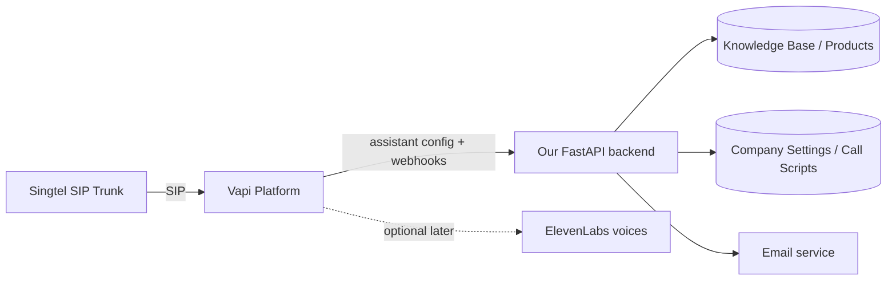

## Objective
Replace the custom-built SIP→Asterisk→AudioSocket→EnergyVAD→STT→LLM→TTS pipeline (which cannot do natural turn-taking) with **Vapi**, a purpose-built voice AI platform with proper turn-detection, barge-in, and native SIP trunk support. Our FastAPI backend stays the "brain" (knowledge base, products, call scripts, transfer logic, email, call summaries) — Vapi just becomes the ears/mouth/telephony layer, calling our backend via webhooks. ElevenLabs voice can be plugged into Vapi later (Vapi natively supports ElevenLabs as a TTS provider) without any further backend changes.

## What gets retired vs kept
- **Retired** (for phone calls only): `deploy/asterisk/*`, the `asterisk` service in `docker-compose.yml`, and `app/voice/audiosocket_server.py`'s SIP-facing role. Code isn't deleted immediately — disabled/left in place until Vapi is confirmed working, then removed in a follow-up cleanup.
- **Kept unchanged**: browser-based voice chat (`app/voice/voice_ws.py` if separate from phone calls — needs confirmation during implementation), all knowledge base / products / settings / onboarding / script wizard work already built, `ChatService.handle_fast`.

## Backend changes
1. **New router `app/api/routes/vapi.py`** — webhook endpoints Vapi calls during a live call:
   - `POST /api/v1/vapi/webhook` — main server-URL handler for Vapi's function-call / message events (`assistant-request`, `function-call`, `end-of-call-report`, `transcript` events per Vapi's webhook schema).
   - Function tool: `search_knowledge_base(query)` → wraps existing `knowledge.py` search logic used by `ChatService`.
   - Function tool: `transfer_department(department)` → looks up `_company_transfer_message`/`_company_dept_intro` equivalents from company settings (reuse logic from `audiosocket_server.py`, move into a shared helper e.g. `app/voice/branding.py` so both old and new paths can use it during transition).
   - `end-of-call-report` handler → generate call summary (tone/outcome/next steps) and trigger the email-to-admin/lead flow already built in `notification_service.py`.
   - Auth: verify Vapi's webhook signing secret (`X-Vapi-Signature` header) against a `VAPI_WEBHOOK_SECRET` env var.
2. **`app/core/config.py`** — add `VAPI_API_KEY`, `VAPI_WEBHOOK_SECRET`, `VAPI_ASSISTANT_ID` settings (loaded from env, no hardcoded secrets).
3. **`app/main.py`** — register the new `vapi` router.
4. **Assistant provisioning script** (`scripts/vapi_setup.py` or a one-off admin endpoint) — creates/updates the Vapi Assistant via Vapi's REST API using our company's greeting/script/product data (pulled from `CompanySettingsModel.agent_overrides` + `ProductModel`), so admins editing the Script Wizard / Products catalog in our existing UI automatically updates what Vapi's assistant says (push-on-save, reusing the existing settings save handler).
5. **`.env.example` / deployment env** — document the 3 new Vapi env vars.

## Telephony/SIP changes
- Vapi supports "Bring your own SIP trunk" (Vapi ↔ Singtel directly). We register the Singtel trunk credentials (from the technical PDF: SIP server `52.77.0.62`/`sipsg01.b3networks.com`, username `sip60956779`, DDI `+6564708728`, TLS 1.2, SRTP) inside Vapi's dashboard/API as a "Phone Number" of type BYO-SIP-trunk.
- `docker-compose.yml` — comment out/disable the `asterisk` service (not deleted, so we can roll back if Vapi has issues) once Vapi inbound calls are verified working end-to-end.
- No changes needed to Singtel/ACOM side — DDI and credentials stay the same, only where they terminate changes (Vapi instead of our Asterisk box).

## Frontend changes (minimal)
- `frontend/app/settings` (or a new small "Voice Provider" panel) — show Vapi connection status (assistant ID configured, webhook reachable) so admin can see at a glance if voice is live. No new complex UI needed since script/product editing UI already exists and will drive Vapi via the sync mechanism above.

## Rollout steps
1. You sign up at vapi.ai, grab the API key + create a phone number resource (BYO SIP trunk) with Singtel's credentials, and give me the API key + webhook secret.
2. I implement the webhook router + assistant sync script (`app/api/routes/vapi.py`, config, main.py registration).
3. Deploy to VPS (GitHub push + `docker compose up -d`), set the 3 new env vars in the VPS `.env`.
4. Run the assistant-sync so Vapi's assistant reflects your current greeting/products/call scripts.
5. Test call to +6564708728 → verify: warm greeting, natural back-and-forth (no talk-over), correct department transfer, no hallucinated products.
6. Once confirmed stable, disable the `asterisk` container and old AudioSocket phone-call path.
7. (Later) Add ElevenLabs API key inside Vapi's assistant voice config — no backend code changes needed for this step.

## Verification / Definition of Done
- Vapi webhook endpoint reachable and signature-verified (test with Vapi's webhook test tool).
- Live test call: agent waits for caller to finish speaking before responding; caller can interrupt naturally; department transfer works with a spoken transfer message (no dead air); no hallucinated product info (grounded via `search_knowledge_base` tool call only).
- Call summary + admin/lead email fires after `end-of-call-report`.
- `python -m py_compile` on all new/edited backend files; `git push` to GitHub; VPS `docker compose` rebuild confirmed with no duplicate containers and clean logs.

## Traceability
| Step | Files | Verification |
|---|---|---|
| Webhook router + tools | `app/api/routes/vapi.py`, `app/voice/branding.py` (new shared helper), `app/main.py` | Vapi test webhook call returns 200; function-call tools return correct KB/transfer data |
| Config | `app/core/config.py`, `.env.example` | Settings load without error, no secrets hardcoded |
| Assistant sync | `scripts/vapi_setup.py` (or endpoint) | Vapi dashboard shows assistant with correct greeting/products after running sync |
| SIP cutover | `docker-compose.yml` (disable asterisk), Vapi dashboard phone number config | Live call to Singtel DDI answered by Vapi assistant, not Asterisk |
| Email/summary | `app/services/notification_service.py` (reuse) | Test call → summary email received |

## Open items to confirm during implementation
- Whether `app/voice/voice_ws.py` (browser voice, if it exists separately) stays untouched — will confirm by reading that file before making changes.
- Vapi pricing/usage tier you're on, in case of rate limits on webhook calls.

Once you approve, I'll wait for your Vapi API key + webhook secret + BYO-SIP phone number ID before implementing the webhook router (steps 2 above).
